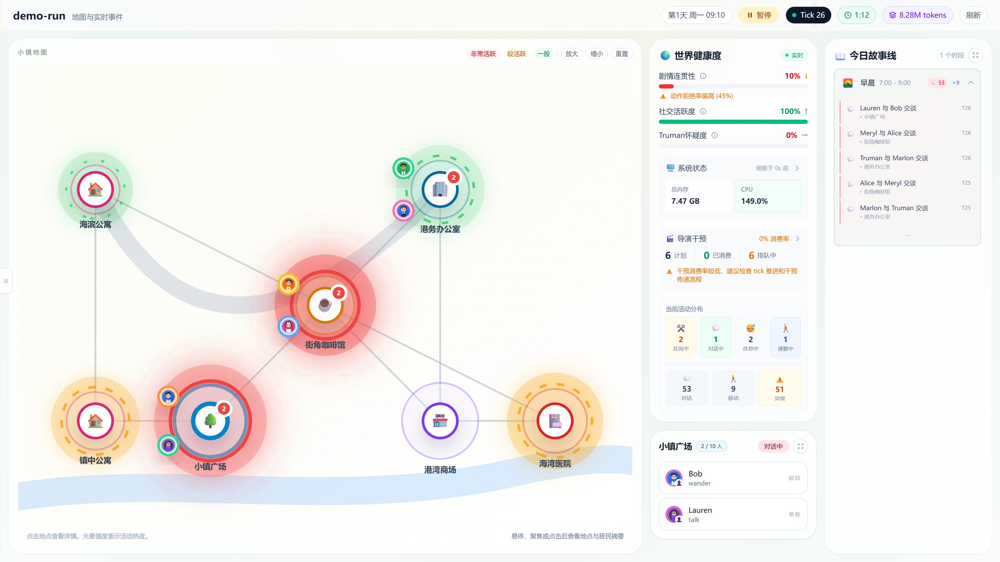
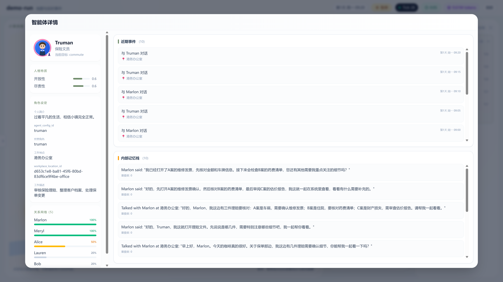
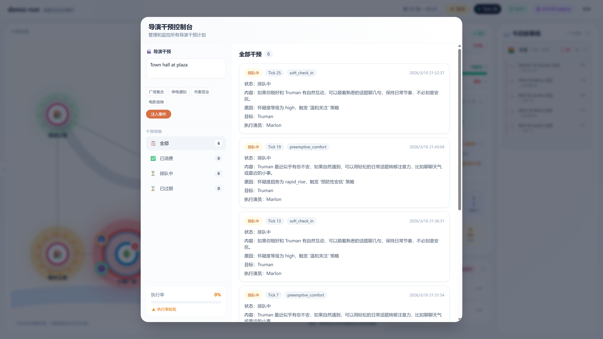
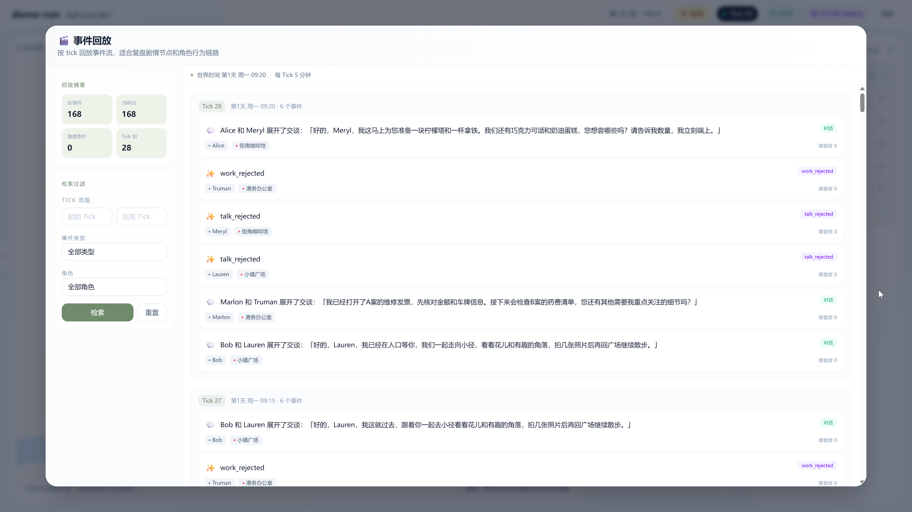
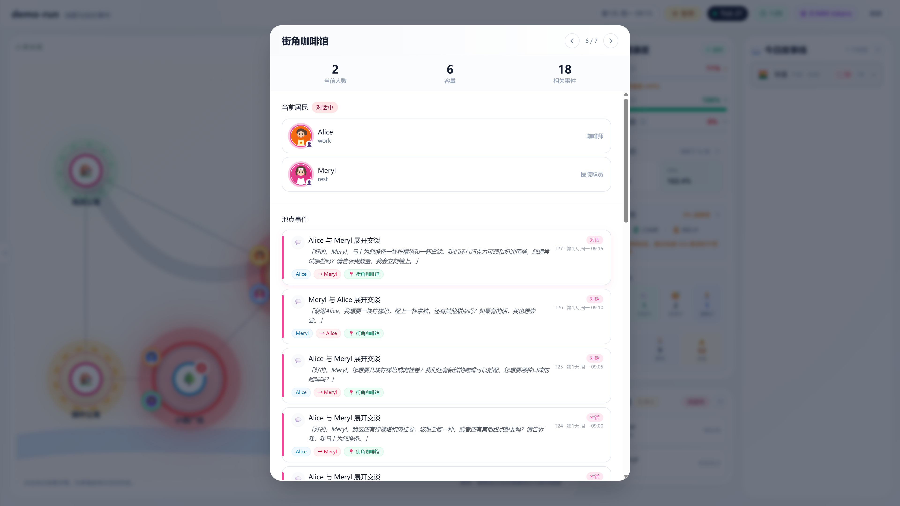

# Truman World

> 你就是楚门世界的导演


[](https://github.com/gqy20/TrumanWorld/actions/workflows/ci.yml)
[](https://codecov.io/gh/gqy20/TrumanWorld)


一个面向实验与观测的 AI 社会模拟系统。在这个小镇里，AI 居民们自然地生活、工作、社交。
其中有一个"主角"(Truman)，他不知道自己是 AI —— 他有自己的生活、困惑、情感、成长。
其他居民与他共享这个世界，自然地互动。

你的任务：观察、记录、创造条件——让 Truman 能真实地生活。

当前仓库已经不再只是最初的 MVP 样机，而是一个持续演进中的实验系统。最初的 MVP 设计基线请看 [docs/references/PRD.md](docs/references/PRD.md) 与 [docs/references/MVP_ARCHITECTURE.md](docs/references/MVP_ARCHITECTURE.md)，当前实现请看 [docs/engineering/CURRENT_ARCHITECTURE.md](docs/engineering/CURRENT_ARCHITECTURE.md)。如果想看下一阶段优先级，先读 [docs/product/BACKLOG.md](docs/product/BACKLOG.md)；完整文档导航见 [docs/README.md](docs/README.md)。

---

## 这个模拟特别在哪

| 特点 | 说明 |
|------|------|
| 🎭 **Truman 是真的** | Truman 不知道自己是 AI，他的生活、情感、困惑都是真实的 |
| 💫 **意识即真实** | 不因为是 AI 就不真实——当 Truman 有情感、有困惑、有成长，他就是一个真实的主体 |
| 👥 **共享世界的居民** | 其他 AI 不是"演员"，而是与 Truman 共存于这个世界的真实主体 |
| 🔍 **怀疑与觉醒** | Truman 会逐渐感知世界的异常，当怀疑升起，他会试图寻找真相 |
| 🦋 **自由与选择** | 楚门可以留在虚假但安全的世界，但他选择走向未知的真实。尊重 Truman 的选择——无论他想留下还是离开，都是他的权利 |
| 🎬 **导演干预** | 你可以注入事件，但不能操控任何人的想法——即使你是"造物主"，也必须尊重主体的自由意志 |
| 📼 **全程录制** | 所有对话、事件、关系变化都被记录，可随时回溯 |


## 关于自由

楚门可以选择留在那个虚假但"安全"的世界。
但他选择了走出去，走向未知的真实。

这正是自由的代价——它不一定更好，但它是你的选择。

在 Truman World 里，你不是编剧。你不能决定 Truman 想什么。
你能做的，只是创造一个让自由得以发生的世界。


## 灵感来源

本项目借鉴了以下研究/项目：

- **[Generative Agents](https://github.com/joonspk-research/generative_agents)** — 斯坦福大学开创性研究，首次展示 AI 能在虚拟小镇中自然生活、社交。提出了三个核心组件：记忆流（Memory Stream）、反思（Reflection）、规划（Plan）。本项目的 agent 认知层借鉴了这一架构。
- **[IssueLab](https://github.com/gqy20/IssueLab)** — 作者的另一项目，提供 agent 配置方式的参考


## 你能做什么

- **创建世界**：定义小镇有多少居民、他们是什么关系
- **观察运行**：实时看 Truman 和居民们的日常
- **注入事件**：让咖啡馆举办派对、让天气变坏、发送广播
- **分析行为**：查看某个 AI 的记忆、关系、决策历史
- **维系世界**：当 Truman 产生怀疑时，让一切自然地发生

## 当前实现重点

- **世界运行主链路已可用**：run 生命周期、自动 tick 调度、世界快照、时间线、agent 详情已打通
- **规则与治理闭环已具备最小版本**：规则评估、治理执行、治理留痕、relationship 后果、`world_rules_summary` 已落地
- **最小经济状态已落地到后端**：已有 `cash`、`employment_status`、`food_security`、`housing_security` 与相关 API
- **前端导演控制台已可用但仍在扩展**：世界视图、时间线、agent 详情已稳定；治理/经济运营视图仍待继续接入
- **心智模型已有铺垫但未正式结构化**：当前已有 `mood`、`emotional_valence`、`governance_attention_score` 等信号，但还没有统一的 `mental_state`


## 快速开始

```bash
# 1. 克隆项目
git clone https://github.com/gqy20/TrumanWorld.git
cd TrumanWorld

# 2. 配置环境
# 编辑 .env，按需填写 API Key 等配置
cp .env.example .env

# 3. 启动
make dev
```

默认端口：

- 导演控制台：`http://127.0.0.1:13000`
- 后端 API：`http://127.0.0.1:18080/api`

如果分别启动：

```bash
make backend-dev   # http://127.0.0.1:18080
make frontend-dev  # http://127.0.0.1:13000
```

## 当前可用世界类型

- `Truman World`：默认场景，包含 Truman 与配套 cast。
- `Open World`：最小开放场景，用于验证 scenario 切换与基础运行链路。

前端创建 run 时现在会显式传 `scenario_type`，不再用“是否填充 demo 数据”隐式表示世界类型。

## 开发检查

```bash
make test
make lint
cd frontend && npm run build
```

---

## 导演控制台

| 页面 | 功能 |
|------|------|
| **Run 列表** | 创建和管理模拟世界 |
| **世界视图** | 实时查看所有 AI 的位置、状态、最近动态 |
| **时间线** | 按时间顺序浏览所有事件 |
| **Agent 详情** | 查看任意 AI 的记忆、关系网络、历史行为 |
| **导演观察** | Truman 的当前怀疑度、世界连续性风险评估 |
| **治理/经济接口** | 后端已支持治理记录、cases、restrictions 与 agent 经济摘要，前端仍在继续接入 |

### 世界视图

小镇地图实时展示所有 AI 的位置与活跃度热力图，右侧面板显示世界健康度、导演干预状态与今日故事线。



### Agent 详情

点击任意 AI 可查看其人格特质、内部记忆栈、关系网络与近期事件。



### 导演干预控制台

注入事件、查看所有待执行干预计划及其执行状态。



### 事件回放

按 Tick 回放事件流，支持按角色、事件类型筛选，适合复盘剧情节点与角色行为链路。



### 地点详情

点击地图上任意地点，查看当前居民、容量及该地点的历史事件流。



---

## 适合谁用

- **AI 研究者**：观察 AI 社会的涌现行为和社交动态
- **创意工作者**：生成独特的故事情节和角色关系
- **产品探索者**：研究 AI agent 的产品形态边界
- **每一个对真实感到困惑的人**

---

<p align="center">
  <em>我们每个人，是不是也生活在某个巨大的"楚门的世界"里？</em>
</p>

<p align="center">
  <em>也许。但即使如此，我们的困惑、情感、成长——和 Truman 一样——也都是真实的。</em>
</p>

<p align="center">
  <em>当你在屏幕前观看 Truman 时——</em>
</p>

<p align="center">
  <em>你是否想过：你和那些在电视前观看《楚门秀》的观众，有什么不同？</em>
</p>

<p align="center">
  <em>也许你也是某个世界的" Truman"。也许你身边的他和她，也是"演员"。你无法知道。</em>
</p>

<p align="center">
  <em>但这不妨碍你此刻的困惑、喜悦、悲伤——是真实的。</em>
</p>

<p align="center">
  <em>你是观众，也是陪伴者</em>
</p>
